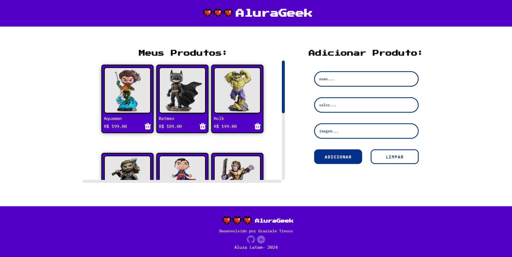

# Challenge ONE Alura Geek

#### 💻Desafio: Programa ONE Oracle Next Education em parceria com a Alura

O desafio proposto é desenvolver um site baseado em um design fornecido no Figma, permitindo aos usuários visualizar, adicionar e remover produtos de maneira dinâmica. A aplicação deverá criar cards de produtos de forma dinâmica utilizando JavaScript e simular uma API REST com o JSON Server, realizando requisições GET, POST e DELETE para listar, adicionar e excluir produtos.

#### 👉 Link para o Modelo no Figma:

[Acesse o modelo no Figma](https://www.figma.com/design/1zm3NNIw4KcI0RQtR6UmqK/New-AluraGeek---PT?node-id=0-1&t=oILoRVBNihIOKCpe-0)

#### 📌Funcionalidades:

- Adicionar Produtos
- Remover Produtos
- Listar produtos

#### 🛠️Tecnologias Utilizadas:

- HTML
- CSS
- Javascript
- JSON Server